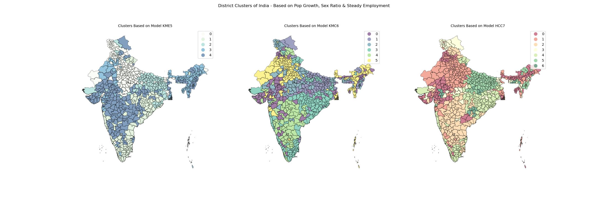

# Clustering Districts of India Based on 2011 Census Data

## Table of Contents

- [Purpose](#purpose)
- [Possible Practical Applications](#possible-practical-applications)
- [Main Source Code Files](#main-source-code-files)
- [Brief Summary of My Approach](#brief-summary-of-my-approach)
- [Some of The Issues Addressed During Cleaning](#some-of-the-issues-addressed-during-cleaning)
- [What I learned](#what-i-learned)

Note : Some plots had to be detached from the notebooks due to concerns about notebook size. Some of them are here (in this repository), and some had to be uploaded [here](https://1drv.ms/f/s!Ag4Lt0BAwivG5QMDT-lICszZG-Sy?e=ZHTGNB) separately - more details in the [Source Code](#main-source-code-files) section.

### Purpose

Goal of the project is to use the latest Indian census data (from 2011) to cluster Indian districts based on Decade-on-Decade Population Growth, Sex Ratio, and Percentage of Population (Male & Female) having Steady Employment.

### Possible Practical Applications

Although I am not going to delve into the intricacies of the causes behind population explosion, there are some globally accepted ideas - Fertility and Advances in Medical Facilities are often cited as the most dominant driving factors behind the ever-growing population. But when we look at the population increase rate over the decades and over all the districts of a country like India and compare them - the common factors should cancel each-other out, and we should get patterns unique to each region. For instance, things like Flourishing Industries (Bengaluru, Mumbai), Educational Institutes (IITs in Kharagpur, Kanpur), Religious or Tourist attractions (like Varanasi, Rajasthan), Administrative Centers (like Delhi) etc. can attract a lot of migration that would be unique to that region and cause an increase in Population.

Add Sex Ratios and People within Spending Age with Stable Income to that mix - when we cluster this dataset, we might be able to identify groups with similar backgrounds and possible job security at a somewhat comparable level. Point to note here is that we don't have income range available in census data, just number of people in various job categories - whether they have worked for more than 6 months in the previous year (Main Workers, this is the class we use in our analysis), whether they have worked for 3 to 6 months in the previous year or worked less than 3 months (Marginal Workers) etc. Now my assumption here is that the groups or clusters that we identify might show similar behavioral patterns, or react similarly to comparable stimuli based on this shared similar background, stable income etc. - and that can be valuable insight.

Use cases can be far and wide - A B2C company which has done well in a certain region may be able to identify where their next customers can be at. Another company may be able to identify which ad campaign they should reuse for which region - based on which one resonated with which demographics.

To be fair, our latest census information is already more than a decade old. So, practically using these results in a modern day business is not a viable option. However, I believe this project sets up a good template for how to extract valuable insights from a similar (and hopefully current) data source. We might want to switch up the variables as well, since the census data is vast - and I have only used a very small subset (essentially 3 variables).

### Main Source Code Files

1. [getData](getData.ipynb) : Scraping and downloading the files from [censusindia.gov.in](https://censusindia.gov.in). I gathered 2 types of State-wise data (36 files each) -
    - Decadal Variation in Population from 1901 to 2011 for each state/district (PC11_A02), downloaded files were kept in [PopVarFiles](PopVarFiles) directory.
    - General Economic Tables showing breakdown of Main Workers, Marginal Workers & Non-Workers by Age & Sex (PC11-B01), downloaded files were kept in [WorkFiles](WorkFiles) directory.
2. [LoadingIndia](LoadingIndia.ipynb) : Among those 72 files, 1 file of each type belonged to India - containing data for the whole country and also individual states (state files contained data for the whole state and every district in the state). I used these India files as a way to get an idea about how to process this data. This was sort of a dummy run to see what kind of Data Manipulation was needed to get the data in the desired form. A lot of steps used in the main process was test run and explained here. In later part of the project, I incorporated the data as well. There are a few Plotly graphs in the notebook that GitHub won't be able to show, the notebook can be opened via [nbviewer](https://nbviewer.org/github/koustavin/censusclustering/blob/main/LoadingIndia.ipynb) for better visibility.
3. [DataPreprocessing](DataPreprocessing.ipynb) : Main notebook containing Data Wrangling and Data Cleaning steps applied to each of the downloaded Excel files. Also contains some basic Visual Analysis on the final dataset.
4. [Clustering](Clustering.ipynb) : Actual clustering performed on the cleaned dataset, and the clusters visualized. Initially, I was just planning to apply KMeans on the Scaled dataset, but the separation between the clusters was very small - it didn't look convincing enough for me. So, apart from the euclidean distance based KMeans model, I also opted for correlation (since I am after all trying to find relationships between districts based on their population growth rates, female population percentages etc.) based KMeans and Hierarchical Clustering models - this is how I ended up using all 3 models everywhere, even in the maps.

    This notebook contains some 3d Plotly graphs exploring the data points in a 3d space (dimensions reduced via PCA) with cluster identities assigned by each model - these had to be taken out due to size constraints. These plots are uploaded in [OneDrive](https://1drv.ms/f/s!Ag4Lt0BAwivG5QMDT-lICszZG-Sy?e=ZHTGNB) as HTML files - unfortunately, these need to be downloaded and viewed in a browser. I had tried a lot of options, but this looks like the best one for Plotly.

    The notebook is also missing couple of static(GeoPandas Choropleth) multi-plot graphs which explored how two of the features ([Population Variation](StaticPlots/Clustering_PopVar_Clusters.jpg), [Female Percentage Variation](StaticPlots/Clustering_FemPct_Clusters.jpg)) varied across clusters for each model - these have been uploaded in GitHub itself separately. Each of these plots were adding around 13 MB to the notebook size, and GitHub was having trouble rendering iPython notebooks whenever notebook size reached near 30 MB.
5. [Map](Map.ipynb) : This notebook is all about displaying the district-wise features and resulting Clustering on Indian Map, after another round of Data Cleaning (on the new map dataset). Map shape-files/data downloaded from [www.arcgis.com](https://www.arcgis.com/home/item.html?id=cba8bddfa0ab43ddb35a7313376f9438), uploaded by Vijay Meena.

    The static maps are present in the notebook, but had to remove the interactive (some animated) Plotly Choropleth maps from the notebook. I have uploaded them in [OneDrive](https://1drv.ms/f/s!Ag4Lt0BAwivG5QMDT-lICszZG-Sy?e=ZHTGNB) location mentioned earlier - these are in HTML format, and need to be opened in a browser.

### Brief Summary of My Approach

1. Simultaneously Validated and Loaded each Population file by loading it, verifying data/datatypes and cleaning it as required and then merging it to the master population dataset. Issues were found, and the loading script was modified multiple times to address them. Also performed modifications to the table as per my plans to remove some features and to add some calculated features as well. Then followed the same process for Work files.
2. Further validations and cleaning tasks were performed on the resulting master datasets (population & Work). Population dataset's null values were filled.
3. Both the datasets were pivoted so that each record belonged to each district, and then they were merged to form one master dataset containing data for all the 640 districts. This master Dataset also needed to be Scaled before I could try to put them in clusters.
4. Then it was time to apply KMeans Clustering on the scaled dataset - but the clusters were not very distinct. Even after employing Elbow Plot & Silhouette Analysis the number of KMeans clusters to use wasn't very distinguished, indicating that KMeans algo was probably not a right fit for this dataset.
5. At this point, I delved into correlation based clustering models. My rationale was that after all I am trying to find similar patterns of Population Growth, Sex Ratio, and Main Worker percentage. For each district, I had 12 features that indicated the history of population growth in that district, 13 features that indicated history of sex ratio (Female Population Percentage) changed (or didn't change) over the years, and the percentage of people (male/female - since in this case both were complemented by people with less steady employment) in that district (in 2011) who had earned for 6 moths or more in the previous year (Main Workers) in Rural and Urban areas. If my model was based on the correlation between these features - that would give me exactly what I wanted, districts that were similar in terms of these features.
6. I tried 2 correlation-based models - a KMeans model on the correlation matrix of the scaled dataset, and a Hierarchical Clustering model based on Complete linkage of Correlation-Based distance between features. For rest of the project I used all 3 models -
    - Model 1 : KME5 - KMeans based on Euclidean distance between datapoints, 5 Clusters
    - Model 2 : KMC6 - KMeans on Correlation-based distance between datapoints, 6 Clusters
    - Model 3 : HCC7 - Hierarchical Clustering on Correlation-based distance between datapoints, 7 Clusters
7. Through various distributions and plots I tried to explore the features and how they varied in each cluster across the 3 models. Two of these feature explorations looked like these (slightly lower quality, check links in [Source Code](#main-source-code-files) section for full resolution versions) :

| Variation of Population Growth | Variation of Female Percentage |
| :--- | ---: |
| | |

8. After a lot of cleaning efforts (the Maps GeoPandas dataset deviated significantly from our Census dataset - since a lot of geographic boundaries had changed since 2011), I was able to plot the features and clusters in the map of India.

    This is how the 3 sets of district clusters look when plotted on Map of India : 

### Some of The Issues Addressed During Cleaning

1. Each Excel file had some extra rows at the top and bottom and the number of such rows varied over each file. These rows ended up as extra rows in the final table that was created by pandas.read_excel. To address this, I had to define what can constitute the beginning and end of data table for each type of files, and found the row index corresponding to those - then sliced the table based on those row indexes.
2. Nagaland (and some other) Decadal Population Variation (or Population) files had some anomalies that caused pandas.read_excel to load all the actual data into a multi-index and the actual dataframe was just nulls. I couldn't figure out what the anomaly was, but using usecols option resolved the issue.
Numeric Data was often muddled with whitespace, comma etc. had to clear out all that to get the numerical value (float or int).
3. The actual census for various states sometimes happened before or after the national census year (sometimes by a few years). To harmonize the years, I kept all of them at the same census years (2011, 2001, 1991 etc.).
4. For 3 districts in Population files, name was split over multiple lines. I found it while validating whether each district has 12 or multiples (for multiple states having districts with same name, or union territory and district sharing same name etc.) thereof number of records in the population dataset - one for each census year. I was not expecting that, and hence all the files had to be reloaded in a way that this issue can be handled - had to identify each such case while loading and join the district names which shared the same district code.
5. Population Dataset had missing values - they represented valid systemic issues (they are Missing Not At Random, like no census performed, or gender data not available etc.). However, if I removed them from the dataset altogether, I would have to remove them for all the districts that have those datapoints available - we then risk missing out on the bigger picture. As such, I wanted to fill those missing values in such a way that the overall trend for each district remains intact. I used a combination of Simple Linear Regression, and Mean proportionate to corresponding value for the country (meaning corresponding value for India, loaded in [LoadingIndia](LoadingIndia.ipynb) notebook) for that census year (instead of Mean/Median) to fill those missing values.
6. Scaling was a major decision. At first, I was under the impression that I won't need scaling - since when I look at the data for a single district, all the values are percentages (mostly of total population of that district) - so they are already on a similar scale. I had run a bare bone KMeans model on the unscaled data, and the algo clustered almost all districts together - that broke my misconception, although data for each district was somewhat scaled already, they were not scaled with respect to each other. Plus, there were major outliers, for example, in 1961 census Chandigarh recorded a population growth of 394% over 1951 census, mean population growth for the whole country that year was 27% with standard deviation of 31 - and even that is not the maximum (or 'oulierest') of outliers, we have more than 30 instances where a district's population more than doubled in a decade. Outliers are huge concern while using clustering datasets - it's common for clustering algo to put outliers in separate cluster, but that then defeats our purpose of looking at overall trends. RobustScaler is said to be robust to outliers, but that wouldn't have worked in this case - since, RobustScaler merely ignores the outliers (so that, the outliers don't impact the scaling), but the outliers still exist as outliers in the scaled dataset. To truly address the outliers, I had to use non-linear transformation of QuantileTransformer.
7. The GeoPandas dataset I have used required some major cleaning efforts, since that dataset (somewhat) represented India of 2019 (I think) - and I had census data (and clusters) as per India of 2011. Apart from usual name mismatches caused by different spelling used by 2 different datasets - State of Telengana was created after 2011, a lot of districts were renamed, or divided into smaller districts etc. To resolve these conflicts, I had to manually check and research each difference and had to take a call on what should be done to match Map dataset with our Census dataset, the [Notes](Notes4NewDistrictsMapping.txt) file contains some details about these decisions.
8. For Delhi (NCT of Delhi) - Map had just one district, Census dataset had 9 (with different clusters assigned). In order to use this map, I had to sacrifice some granularity and had to paint all of Delhi as the majority cluster.
9. The cleaning efforts also caused duplicates in the maps dataset (for example - Maharashtra's Thane had split into 2 districts - Thane and Palghar, to match with Census data I had to use Thane as district name for both of them) - while this worked fine for GeoPanda's Choropleth plot method, this caused issue with Plotly. Plotly Choropleth expects geojson IDs (State, District combination in our case) to be unique for each geometric boundary. To resolve this, I had to merge multiple geometry polygons (that share same ID) using dissolve method.

### What I learned

- Used for the first time : Quantile Transformer, Hierarchical Clustering, GeoPandas, Plotly, GeoJSON
- Gained an in depth knowledge of clustering in general, and appreciation for Euclidean distance vs Correlation-based distance
- Learned how to save/load Multi-Index datasets with ease - hadn't found proper instructions after a lot of searching, but decided to give npz a try after seeing how it worked well in preserving scipy sparse arrays (for my next project).
